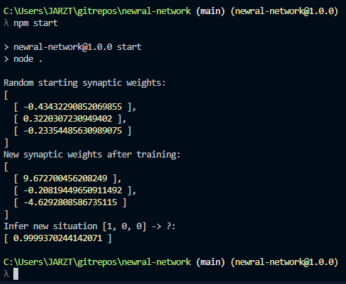

# Newral Network - How neural networks learn?

A very simple neural network that can be trained and then infer new situations. Every step is verbose, all involved code is here, no external dependencies required. May be it needs a little of work to make it easier to read, but for now it is a good starting point.

## Requirements
NodeJS 10+, and that's it.

## Running
First build it with `npm run build` and then run `npm start`

## Plans
- Get rid of spanglish
- improve readability
- Add better comments
- Set the correct types instead of `any`
- Make my team proud
